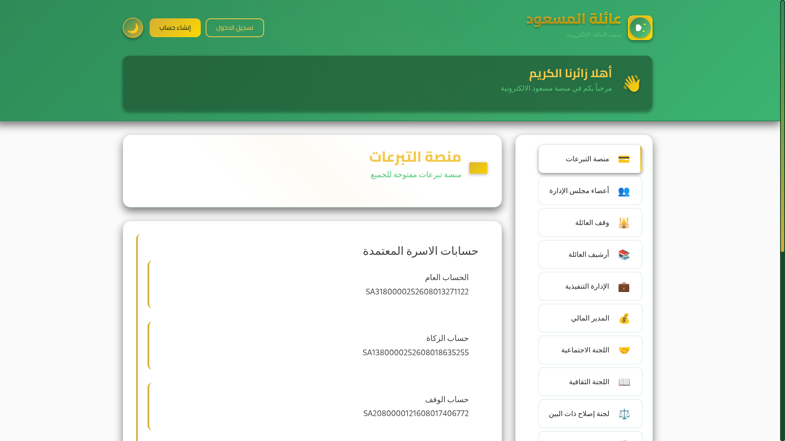
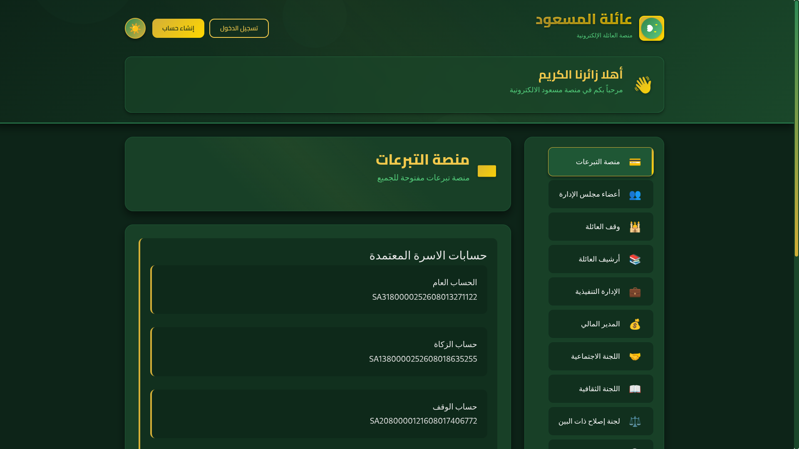

<h1 align="center">This is Masoud Family Platform</h1>
<hr />

## 🏗️ **Project Overview**

The **Masoud Family Platform** is a comprehensive, multi-module web application designed to manage family affairs, donations, committees, and community services. Built with modern technologies including **Laravel 10**, **React 18**, and **MySQL**, it provides a secure, scalable, and feature-rich platform for family management with role-based access control with docker containers.

---

## 📁 **Project Structure**


<hr />



[▶ Watch the video](Screencasts/vid.mp4)

---

## 🔐 **Authentication & Security System**

### **JWT-Based Authentication**
- **Access Tokens**: Short-lived (60 minutes) for API requests
- **Refresh Tokens**: Long-lived (14 days) for token renewal
- **Token Blacklisting**: Immediate token invalidation on logout
- **Multi-device Support**: Concurrent sessions management

### **Security Features**
- ✅ **Password Policies**: Minimum 8 chars, uppercase, lowercase, numbers, symbols
- ✅ **Password History**: Prevents reuse of last 5 passwords
- ✅ **Brute Force Protection**: Rate limiting with exponential backoff
- ✅ **Session Management**: Automatic logout on password change
- ✅ **Email Verification**: Double opt-in with expiry tokens
- ✅ **IP Tracking**: Log all authentication attempts

### **Email Verification Flow**
```
Registration → Verification Email → Token Validation → Account Activation
    ↓
Resend Option ← Token Expiry (24h) → Admin Bulk Verification
```

---

## 👥 **User Roles & Permissions**

### **Role Hierarchy**
```
SUPER_ADMIN (الادارة العليا)
    ├── BOARD_MEMBER (مجلس الإدارة)
    ├── EXECUTIVE (الإدارة التنفيذية)
    ├── FINANCIAL_MANAGER (المدير المالي)
    ├── SOCIAL_COMMITTEE (اللجنة الاجتماعية)
    ├── CULTURAL_COMMITTEE (اللجنة الثقافية)
    ├── RECONCILIATION_COMMITTEE (لجنة إصلاح ذات البين)
    ├── SPORTS_COMMITTEE (اللجنة الرياضية)
    ├── MEDIA_CENTER (المركز الإعلامي)
    └── FAMILY_MEMBER (عضو العائلة)
```

### **Permission Matrix**
| Module | Super Admin | Board | Executive | Family Member |
|--------|-------------|-------|-----------|---------------|
| Donations | Full | View/Approve | View | Donate Only |
| Family Tree | Full | View/Edit | View | View Own |
| Financial | Full | Reports | Limited | None |
| Committees | Full | Assigned | Assigned | View Only |
| Archive | Full | Full | Limited | Limited |

---

## 🏦 **Core Modules**

### **1. Donation Platform (Public)**
```
Features:
• Public donation campaigns
• Multiple payment methods
• Real-time statistics
• Tax-deductible receipts
• Recurring donations
• Campaign management
```

### **2. Family Management**
```
Features:
• Interactive family tree
• Member profiles with photos
• Relationship mapping
• Birthdays & anniversaries
• Contact information
• Privacy controls
```

### **3. Financial Management**
```
Features:
• Multiple bank accounts
• Transaction tracking
• Budget vs actual reports
• Financial statements
• Payment processing
• Audit trails
```

### **4. Committee System**
```
Social Committee:
• Marriage aid applications
• Family support programs
• Aid request review system
• Beneficiary tracking

Cultural Committee:
• Quran competitions
• Academic awards
• Cultural events
• Advisory sessions

Sports Committee:
• Tournament management
• Team registrations
• Training schedules
• Facility booking
```

### **5. Archive System**
```
Features:
• Complete family history
• Meeting minutes archive
• Sports achievements
• Document storage
• Photo gallery
• Historical records
```

### **6. Media Center**
```
Features:
• News publishing
• Announcements
• Social media integration
• Photo/video gallery
• Publication management
```

---

## 🚀 **API Architecture**

### **RESTful Design Principles**
- **Versioning**: `/api/v1/` prefix
- **Resource-Based**: Nouns over verbs
- **Stateless**: Each request contains all necessary information
- **Cacheable**: Proper cache headers
- **HATEOAS**: Hypermedia as the Engine of Application State

### **Response Standards**
```json
{
  "success": true,
  "message": "Operation completed successfully",
  "data": { /* resource data */ },
  "meta": {
    "timestamp": "2024-01-15T10:30:00Z",
    "version": "1.0",
    "pagination": { /* if applicable */ }
  }
}
```

### **Error Handling**
```json
{
  "success": false,
  "message": "Validation failed",
  "error_code": "VALIDATION_ERROR",
  "errors": {
    "email": ["The email field is required."]
  },
  "meta": {
    "timestamp": "2024-01-15T10:30:00Z",
    "trace_id": "req_123456"
  }
}
```

---

## 🗄️ **Database Design**

### **Core Entities**
```sql
-- Users & Authentication
users (id, email, password, user_type, is_active, email_verified_at)
password_histories (user_id, password_hash, created_at)
sessions (id, user_id, ip_address, user_agent, last_activity)

-- Family Management
persons (id, national_id, full_name_arabic, gender, birth_date)
family_relationships (parent_id, child_id, relationship_type)
family_tree_nodes (person_id, parent_id, position_x, position_y)

-- Financial
bank_accounts (id, bank_name, account_number, balance, is_active)
transactions (id, account_id, amount, type, description, reference)
donations (id, donor_id, amount, campaign_id, payment_method, status)

-- Committees
committee_members (user_id, committee_type, role, joined_at)
aid_requests (id, applicant_id, type, amount, status, reviewed_by)
meetings (id, committee_type, date, location, agenda, minutes)

-- Archive
documents (id, title, description, file_path, category, uploaded_by)
photos (id, album_id, caption, file_path, taken_at, uploaded_by)
events (id, title, description, date, location, category)
```

### **Relationships**
```
User 1───┐    1 Person
         │
         ├─── * Family Relationships
         │
         ├─── * Donations
         │
Committee Member *───1 Committee
         │
         ├─── * Meetings
         │
         └─── * Aid Requests
```

---

## 🎨 **Frontend Architecture**

### **Component Hierarchy**
```
App
├── AuthProvider
├── Router
│   ├── Public Routes
│   │   ├── Login
│   │   ├── Register
│   │   └── Forgot Password
│   └── Protected Routes
│       ├── Dashboard Layout
│       │   ├── Sidebar
│       │   ├── Header
│       │   └── Main Content
│       └── Module Routes
│           ├── Family Tree
│           ├── Donations
│           ├── Committees
│           └── Settings
└── ToastContainer
```

### **State Management**
- **React Context API**: For authentication and theme
- **React Query**: For server state management
- **Local State**: useState/useReducer for component state
- **Local Storage**: For persistent user preferences

### **Styling Strategy**
- **CSS Modules**: Component-scoped styles
- **CSS Variables**: Theme consistency
- **Responsive Design**: Mobile-first approach
- **Dark/Light Mode**: Theme switching support

---

## 🔧 **Technical Stack**

### **Backend**
- **Framework**: Laravel 10.x
- **PHP Version**: 8.1+
- **Authentication**: JWT (tymon/jwt-auth)
- **Database**: MySQL 8.0+
- **Queue**: Redis with Laravel Horizon
- **Cache**: Redis/Memcached
- **File Storage**: AWS S3 / Local
- **Email**: SMTP with Mailtrap/SendGrid
- **API Documentation**: Swagger/OpenAPI

### **Frontend**
- **Library**: React 18.x
- **Routing**: React Router DOM 6.x
- **HTTP Client**: Axios with interceptors
- **Form Handling**: React Hook Form with Yup
- **UI Components**: Custom with Tailwind CSS
- **Charts**: Recharts/Chart.js
- **Maps**: React Leaflet
- **Icons**: React Icons
- **Notifications**: React Toastify

### **DevOps**
- **Containerization**: Docker & Docker Compose
- **CI/CD**: GitHub Actions
- **Monitoring**: Laravel Telescope + Sentry
- **Logging**: Monolog with Logstash
- **Testing**: PHPUnit + Jest + Cypress

---

## 🛡️ **Security Implementation**

### **Authentication Security**
- **Password Hashing**: Bcrypt with cost factor 12
- **Session Fixation**: Regenerate session ID on login
- **CSRF Protection**: Laravel Sanctum tokens
- **XSS Prevention**: Content Security Policy headers
- **SQL Injection**: Eloquent ORM with parameter binding

### **API Security**
- **Rate Limiting**: Per endpoint with Redis tracking
- **CORS Policy**: Strict origin validation
- **Request Validation**: Laravel Form Request classes
- **Input Sanitization**: HTMLPurifier for rich content
- **Output Encoding**: Blade templating engine

### **Data Protection**
- **Encryption**: AES-256 for sensitive data
- **Data Masking**: Partial display of sensitive info
- **Audit Logging**: All critical operations logged
- **Backup Encryption**: GPG for database backups
- **Data Retention**: Automatic cleanup policies

---

## 📊 **Performance Optimization**

### **Backend Optimization**
- **Database Indexing**: Strategic indexes on foreign keys
- **Query Optimization**: Eager loading with constraints
- **Caching Strategy**: Multi-layer caching (Redis + OPcache)
- **Queue Workers**: Async processing for emails & reports
- **CDN Integration**: CloudFront for static assets

### **Frontend Optimization**
- **Code Splitting**: React.lazy() for route-based splitting
- **Bundle Optimization**: Tree shaking with Webpack
- **Image Optimization**: WebP format with lazy loading
- **Service Workers**: PWA capabilities for offline access
- **Preloading**: Critical resources preloaded

### **Monitoring & Metrics**
```
Key Performance Indicators:
• API Response Time: < 200ms (95th percentile)
• Page Load Time: < 3s (First Contentful Paint)
• Time to Interactive: < 5s
• Error Rate: < 0.1%
• Uptime: 99.9% SLA
```

---

## 🧪 **Testing Strategy**

### **Test Pyramid**
```
        E2E Tests (10%)
           /     \
          /       \
Integration Tests (20%)
        /           \
       /             \
   Unit Tests (70%)
```

### **Test Coverage Goals**
- **Unit Tests**: 90% coverage (Models, Services, Helpers)
- **Integration Tests**: 80% coverage (API endpoints)
- **E2E Tests**: Critical user flows (Auth, Donations, Family Tree)
- **Performance Tests**: Load testing with k6

### **Testing Tools**
- **PHPUnit**: Backend unit & integration tests
- **Pest**: Alternative PHP testing framework
- **Jest**: Frontend unit tests
- **Cypress**: E2E testing
- **Laravel Dusk**: Browser automation
- **k6**: Load and performance testing

---

## 🚢 **Deployment Architecture**

### **Environment Strategy**
```
Development → Staging → Production
    ↓           ↓          ↓
Local Docker  AWS ECS   AWS ECS
             + RDS      + RDS + ElastiCache
```

### **Infrastructure as Code**
```yaml
# docker-compose.production.yml
services:
  app:
    build: ./backend
    environment:
      - APP_ENV=production
      - APP_DEBUG=false
    depends_on:
      - mysql
      - redis
      - queue
      
  mysql:
    image: mysql:8.0
    volumes:
      - mysql_data:/var/lib/mysql
      
  redis:
    image: redis:alpine
    
  queue:
    build: ./backend
    command: php artisan queue:work
```

### **CI/CD Pipeline**
```yaml
name: Deploy to Production

on:
  push:
    branches: [main]

jobs:
  test:
    runs-on: ubuntu-latest
    steps:
      - Run backend tests
      - Run frontend tests
      - Run security scan
      
  build:
    needs: test
    steps:
      - Build Docker images
      - Push to ECR
      
  deploy:
    needs: build
    steps:
      - Update ECS service
      - Run database migrations
      - Clear cache
      - Health check
```

---

## 📈 **Scalability Considerations**

### **Horizontal Scaling**
- **Stateless Design**: Easy addition of application servers
- **Database Read Replicas**: For read-heavy operations
- **Redis Cluster**: For distributed caching
- **Load Balancer**: AWS ALB with health checks

### **Vertical Scaling**
- **Database Optimization**: Query tuning and indexing
- **Memory Management**: PHP memory limits and garbage collection
- **Queue Workers**: Auto-scaling based on queue length

### **Data Partitioning Strategy**
```
Partitioning Strategy:
• Users: Shard by geographic region
• Donations: Partition by date range
• Family Data: Shard by family branches
• Archive: Separate storage for old data
```

---

## 🔄 **Migration & Data Strategy**

### **Database Migrations**
- **Version Control**: All migrations tracked in Git
- **Rollback Strategy**: Every migration reversible
- **Data Seeding**: Production-like data for testing
- **Migration Order**: Dependencies clearly defined

### **Data Backup Strategy**
```
Backup Schedule:
• Transaction Logs: Every 15 minutes
• Incremental Backups: Hourly
• Full Backups: Daily (off-peak hours)
• Long-term Archives: Monthly (S3 Glacier)
```

### **Disaster Recovery**
- **RTO**: 4 hours (Recovery Time Objective)
- **RPO**: 15 minutes (Recovery Point Objective)
- **Multi-AZ Deployment**: AWS availability zones
- **Automated Failover**: Route 53 health checks

---

## 👥 **Team Collaboration**

### **Development Workflow**
```
Feature Branch → Code Review → Merge to Develop → Staging → Production
    ↓              ↓              ↓              ↓         ↓
Git Flow       Pull Request   Automated Tests  QA Testing  Blue/Green
```

### **Documentation**
- **API Documentation**: OpenAPI/Swagger with examples
- **Code Documentation**: PHPDoc for backend, JSDoc for frontend
- **Architecture Decisions**: ADR (Architecture Decision Records)
- **Runbooks**: Operational procedures for common tasks

### **Communication Tools**
- **Project Management**: Jira/Asana with Scrum boards
- **Code Review**: GitHub Pull Requests with templates
- **Knowledge Base**: Confluence/Wiki for documentation
- **Incident Management**: Slack + PagerDuty integration

---

## 🎯 **Future Roadmap**

### **Phase 1: Core Platform (Q1 2024)**
- ✅ Authentication & User Management
- ✅ Basic Family Tree
- ✅ Donation Platform
- ✅ Committee Structure

### **Phase 2: Enhanced Features (Q2 2024)**
- 🔄 Mobile Application (React Native)
- 🔄 Advanced Analytics Dashboard
- 🔄 AI-Powered Family Insights
- 🔄 Integration with Government Systems

### **Phase 3: Expansion (Q3-Q4 2024)**
- 📅 Multi-Family Support
- 📅 Internationalization (English/Arabic)
- 📅 Blockchain for Donation Transparency
- 📅 Voice Interface for Accessibility

### **Phase 4: Enterprise Features (2025)**
- 🚀 Advanced Financial Module
- 🚀 Machine Learning Predictions
- 🚀 API Marketplace
- 🚀 White-label Solutions

---

## 📞 **Support & Maintenance**

### **Support Levels**
```
Level 1: User Support (Help Desk)
  ↓
Level 2: Technical Support (Developers)
  ↓
Level 3: System Administration (DevOps)
```

### **Maintenance Windows**
- **Emergency Patches**: Anytime (with notification)
- **Scheduled Maintenance**: Thursday 2:00-4:00 AM (Local Time)
- **Database Maintenance**: Monthly, first Sunday
- **Security Updates**: Within 24 hours of disclosure

### **Monitoring & Alerting**
- **Application Performance**: New Relic/Datadog
- **Error Tracking**: Sentry/Bugsnag
- **Uptime Monitoring**: Pingdom/UptimeRobot
- **Security Monitoring**: AWS GuardDuty + WAF

---

## 🏆 **Success Metrics**

### **Business Metrics**
- **User Adoption**: > 80% of family members registered
- **Donation Growth**: 20% quarter-over-quarter increase
- **Committee Participation**: > 60% active participation rate
- **User Satisfaction**: > 4.5/5 average rating

### **Technical Metrics**
- **System Uptime**: 99.9% availability
- **Response Time**: < 200ms average API response
- **Error Rate**: < 0.1% failed requests
- **Security**: Zero critical vulnerabilities

### **Operational Metrics**
- **Deployment Frequency**: Multiple times per day
- **Lead Time for Changes**: < 1 hour
- **Change Failure Rate**: < 5%
- **Mean Time to Recovery**: < 1 hour

---

## 💡 **Key Differentiators**

1. **Comprehensive Solution**: Single platform for all family needs
2. **Security First**: Enterprise-grade security at all levels
3. **Scalable Architecture**: From small families to large clans
4. **Modern Tech Stack**: Latest technologies with best practices
5. **User-Centric Design**: Arabic-first interface with RTL support
6. **Extensible Platform**: Modular design for future growth
7. **Community Focus**: Built for family bonding and support

---

## 🚨 **Risk Management**

### **Identified Risks**
- **Data Privacy**: Strict compliance with data protection laws
- **Financial Security**: PCI DSS compliance for payments
- **System Scalability**: Proactive capacity planning
- **Team Knowledge**: Comprehensive documentation and training

### **Mitigation Strategies**
- **Regular Audits**: Quarterly security and compliance audits
- **Disaster Drills**: Bi-annual disaster recovery testing
- **Knowledge Sharing**: Weekly tech talks and pair programming
- **Vendor Management**: Multiple service providers for critical services

---

## 🎉 **Conclusion**

The **Masoud Family Platform** represents a state-of-the-art solution for family management, combining robust backend architecture with a modern frontend interface. With its comprehensive feature set, strong security posture, and scalable design, it provides a solid foundation for managing family affairs while maintaining the flexibility to adapt to future needs.

The platform's modular design allows for incremental development and deployment, ensuring that each component meets the highest standards of quality and reliability. Whether for a single family or extended clan networks, this platform provides the tools necessary for effective management, communication, and growth.

---

**Last Updated**: January 2024  
**Version**: 1.0.0  
**Status**: Active Development  
**Contact**: development@masoud.com
